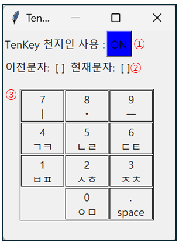

# TenkeyAsChunjiin
Tenkey 를 활용하여 한손으로 천지인 형식으로 한글을 입력할수있게 해주는 어플리케이션입니다.

## 실행파일빌드
```shell
pyInstaller -F -w TenkeyAsChunjiin.py
```

## 실행법
 - dist/TenkeyAsChunjiin.exe 실행

## 사용법

 - 스페이즈, 엔터, esc, 쉼표, 마침표 등 입력시 입력중이던 문자수정 초기화됩니다.
 - PageDown 버튼으로 On/Off 버튼 대체 가능
1. Tnekey 천지인 사용여부(ON/OFF) : 클릭 시 ON/OFF 변경, OFF 일 경우 Tenkey 로 숫자 입력 가능
2. 입력중인 문자 표시기
3. 버튼매핑 및 입력 정보